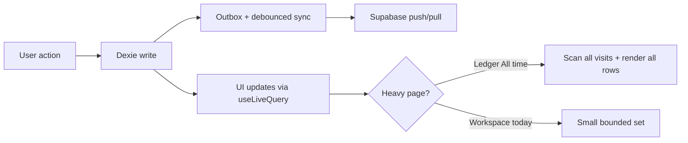

# Keeping Thera.Net fast

How performance works in this app, what can cause slowdowns or latency, and what to do about it — for clinic operators and engineers.

Thera.Net is **offline-first**: most taps read and write **IndexedDB (Dexie)** on the device. The UI should feel instant. Slowness usually comes from **too much work on the main thread** (big lists, heavy aggregations) or **background sync**, not from waiting on the server for every click.

---

## Mental model



**Snappy** = small working set (today, this month) + healthy local DB.

**Slow** = all-time history + big DOM + many live queries firing together.

---

## What already keeps it snappy

| Area | Why it helps |
|------|----------------|
| Offline-first writes | Save visit / patient → Dexie immediately; sync runs in background |
| Outbox coalescing | Rapid edits to one row → one push |
| Delta sync | Pull only `updated_at > cursor`, 1000 rows per page |
| 300ms sync debounce | Bursts of edits don't trigger N syncs |
| Route code-splitting | Ledger, Patients, Settings load on demand (`src/app/router.tsx`) |
| Workspace scoped to "today" | Naturally bounded list |
| Today's payments scoped by date | Workspace stats don't load all payments |

For a **single clinic with hundreds–low thousands of visits**, the current design is usually fine.

---

## What can slow it down

### 1. Full-clinic scans in local storage

Several paths load **all rows for a clinic**, then filter in JavaScript.

`src/repositories/local.ts` — `visits.list()`:

```ts
let rows = await db.visits.where('clinicId').equals(filter.clinicId).toArray();
rows = rows.filter((v) => !v.deleted);
if (filter.from) rows = rows.filter((v) => v.visitDate >= filter.from!);
if (filter.to) rows = rows.filter((v) => v.visitDate <= filter.to!);
```

`patients.search()` loads all clinic patients, then filters in memory.

**Effect:** Fine for hundreds of visits; gets slower at thousands, especially on **Ledger (All time)** and **Patients**.

Dexie already indexes `visitDate` (`src/lib/db.ts`), but `visits.list` does not use it yet.

---

### 2. Many live queries per screen

Heavy pages (Ledger, New visit, Reports, Patients) each run many `useLiveQuery` hooks. **Any** Dexie write to a watched table can re-run **all** of them and their `useMemo` transforms.

**Ledger** (`src/features/visits/LedgerPage.tsx`) loads therapists, all patients, visits, invoice payments, direct payments, open packages, outstanding invoices, and more in parallel.

**Effect:** One visit save can cause a noticeable hitch if the clinic has a lot of history loaded.

---

### 3. No list virtualization

Workspace, Ledger, and Patients render **every row** in the DOM (`src/components/VisitCard.tsx` — cards + table). There is no windowing (`react-window`, `@tanstack/react-virtual`, etc.).

**Effect:** ~50 rows feels fine; 500+ rows can scroll and filter sluggishly, especially on older phones.

---

### 4. Sync engine: full pull after remote changes

`src/sync/engine.ts`:

- Subscribes to realtime `postgres_changes` on **all** synced tables (13).
- Any event schedules a **full** debounced sync (push + pull all tables, 300ms debounce).
- Fallback poll every 5 minutes.

**Effect:** Usually invisible on a quiet clinic. With multiple devices or heavy imports, brief CPU/network spikes and frequent sync-badge updates. **UI writes stay local** — this mostly affects background work, not "Save visit" itself.

---

### 5. Reports and dashboard re-aggregate often

`src/services/dashboardService.ts` and Reports pages often call `repos.visits.list({ clinicId })` **multiple times** per page (open packages, pending work, condition usage, revenue trend by month, etc.).

**Effect:** Reports overview is the heaviest analytics screen; it will lag first as visit count grows.

---

### 6. Initial load / bundle size

Workspace is eager-loaded (good for the default path). The main JS chunk is large (~700KB+ pre-gzip). Dexie, Supabase client, and router all load at boot.

`qrcode` is pulled in via Workspace / Take payment (UPI QR) even if never used.

**Effect:** First visit after a cold load on a slow connection or weak phone. Usually fine once cached.

---

### 7. Network-only operations (expected latency)

These **should** feel slower when offline or on bad Wi‑Fi:

- Login / session refresh
- Invoice issuance (server gap-free numbers)
- Logo / UPI QR upload
- Clinic creation
- First sync after a long offline period

That is by design, not a bug.

---

## Where pain shows up first

| Screen | Trigger |
|--------|---------|
| **Ledger** | Date preset **All time** + thousands of visits |
| **Patients** | Full list + search over all patients |
| **Reports** | Overview with many parallel aggregations |
| **New visit** | Many live queries; usually OK unless catalog/patient lists are huge |
| **Background** | Multi-device edits, bulk historical import, stuck outbox retries |

---

## Keeping it fast — operators (clinic floor)

Low effort, high value:

1. **Default Ledger to a date range** (This month / Last month), not All time, for day-to-day work.
2. **Don't leave Reports open** on a tablet if the clinic has years of data; open when needed.
3. **Keep sync healthy** — fix "sync issue" rows (failed outbox) so the engine isn't retrying forever.
4. **Use a modern browser** on reception hardware; IndexedDB performance varies on very old devices.
5. **Stable Wi‑Fi** for invoice issue and asset uploads; don't expect those offline.

---

## Keeping it fast — engineering backlog

Prioritized when data volume or jank becomes real on clinic hardware.

| Priority | Change | Impact | Main files |
|----------|--------|--------|------------|
| **P1** | Use Dexie **date index** in `visits.list` (`visitDate` between `from`/`to`) | Faster Ledger & reports | `src/repositories/local.ts`, `src/lib/db.ts` |
| **P1** | **Virtualize** Ledger + Patients tables | Smooth scrolling at 500+ rows | `src/components/VisitCard.tsx`, `src/features/patients/PatientsPage.tsx` |
| **P2** | **One** `useLiveQuery` per page for visits; share via context | Fewer re-runs on every edit | Ledger, Patients, Reports pages |
| **P2** | **Lazy-load** `qrcode` only when "Show UPI QR" is clicked | Smaller initial bundle | `src/components/UpiQrModal.tsx` |
| **P2** | Realtime → **pull only the changed table** (not full sync) | Less background work multi-device | `src/sync/engine.ts` |
| **P3** | Memoize Patients filter/sort; `React.memo` on visit rows | Less re-render jank | `PatientsPage.tsx`, `VisitCard.tsx` |
| **P3** | Manual Vite chunks for `dexie` / `@supabase/supabase-js` | Faster first paint | `vite.config.ts` |
| **P3** | Share a per-clinic visit cache for dashboard aggregations | Reports load faster | `src/services/dashboardService.ts` |

---

## What to measure before optimizing

Don't optimize blindly. Reproduce on real clinic hardware when possible.

1. **Ledger** — All time + 2k+ visits: scroll, filter, save a visit (DevTools Performance → main-thread blocking).
2. **Patients** — full list + search latency.
3. **Reports** — overview time-to-interactive.
4. **Sync** — after bulk import (Settings → historical visits); watch sync badge and CPU.
5. **Cold load** — first paint on 3G / mid-range Android if mobile use matters.

---

## Bottom line

You will **not** usually feel server latency on visit logging. You **will** feel **local data size** and **how much each screen loads and renders**.

For current clinic sizes: focus on **usage habits** (Ledger date ranges) and **fixing sync errors**. Plan engineering work (indexes, virtualization, leaner queries) when Ledger "All time" or Reports starts to lag on production hardware.

---

## Related code

| Topic | Location |
|-------|----------|
| Sync engine | `src/sync/engine.ts` |
| Dexie schema & indexes | `src/lib/db.ts` |
| Repository queries | `src/repositories/local.ts` |
| Dashboard aggregations | `src/services/dashboardService.ts` |
| Ledger data loading | `src/features/visits/LedgerPage.tsx` |
| Visit list rendering | `src/components/VisitCard.tsx` |
| Route splitting | `src/app/router.tsx` |
